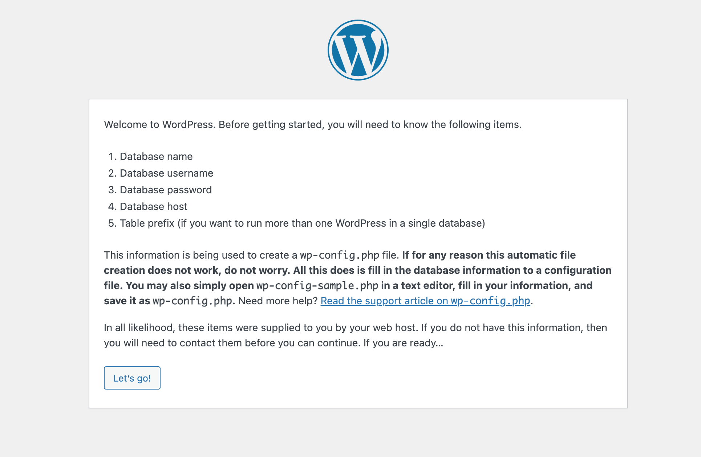
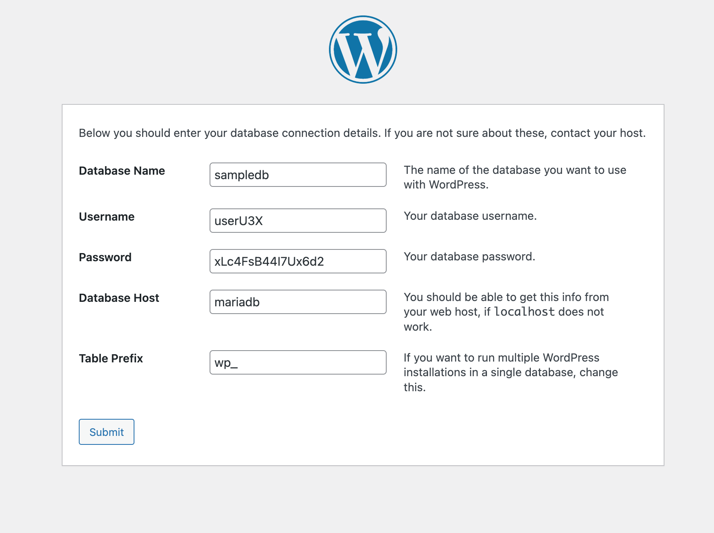
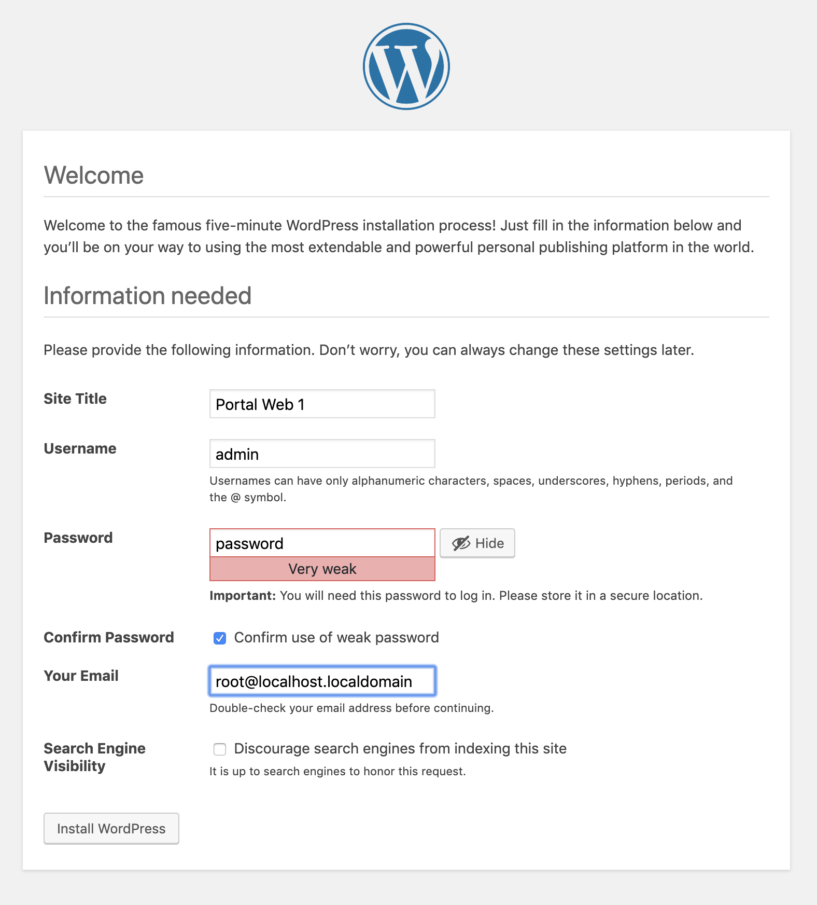
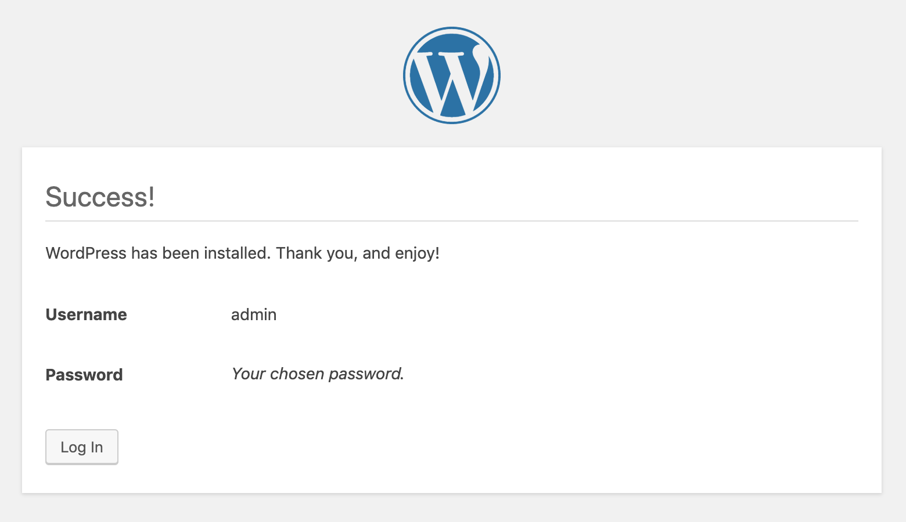

# Talleres
[Inicio](../Inicio.md)


# Taller No 3.
Despliegue de aplicaciones mas complejas donde se cuenta con una BD y un servidor de aplicaciones

# Recuerde todos los pasos de los ejercicios anteriores para persistir los datos

1. Cree un nuevo proyecto 
```
[user0X@bastion ~]$ oc new-project project0X-wordpress
Now using project "project0X-wordpress" on server "https://192.168.64.2:8443".

You can add applications to this project with the 'new-app' command. For example, try:

    oc new-app centos/ruby-25-centos7~https://github.com/sclorg/ruby-ex.git

to build a new example application in Ruby.
````
2. Cree una aplicacion de MySQL que es donde se van a almacenar los datos
```
[user0X@bastion ~]$ oc new-app mariadb-ephemeral
--> Deploying template "prueba/mariadb-ephemeral" to project prueba

     MariaDB (Ephemeral)
     ---------
     MariaDB database service, without persistent storage. For more information about using this template, including OpenShift considerations, see https://github.com/sclorg/mariadb-container/blob/master/10.3/root/usr/share/container-scripts/mysql/README.md.
     
     WARNING: Any data stored will be lost upon pod destruction. Only use this template for testing

     The following service(s) have been created in your project: mariadb.
     
            Username: user02Y
            Password: EAViSVpTroB6Gm1o
       Database Name: sampledb
      Connection URL: mysql://mariadb:3306/
     
     For more information about using this template, including OpenShift considerations, see https://github.com/sclorg/mariadb-container/blob/master/10.3/root/usr/share/container-scripts/mysql/README.md.

     * With parameters:
        * Memory Limit=512Mi
        * Namespace=openshift
        * Database Service Name=mariadb
        * MariaDB Connection Username=user02Y # generated
        * MariaDB Connection Password=EAViSVpTroB6Gm1o # generated
        * MariaDB root Password=k1ihHB3itWllT0YX # generated
        * MariaDB Database Name=sampledb
        * Version of MariaDB Image=10.3-el8

--> Creating resources ...
    secret "mariadb" created
    service "mariadb" created
    deploymentconfig.apps.openshift.io "mariadb" created
--> Success
    Application is not exposed. You can expose services to the outside world by executing one or more of the commands below:
     'oc expose service/mariadb' 
    Run 'oc status' to view your app

3. Verifique que el pod este en ejecucion
```
[user0X@bastion ~]$ oc get pod
NAME                            READY   STATUS             RESTARTS         AGE
mariadb-1-59x4r                 1/1     Running            0               48s
mariadb-1-deploy                0/1     Completed          0               51s
```
4. Cree la aplicacion FrontEnd que contiene el codigo fuente de la aplicacion Wordpress
```
[user0X@bastion ~]$ oc new-app php~https://github.com/wordpress/wordpress

--> Found image c356a13 (9 days old) in image stream "openshift/php" under tag "8.0-ubi8" for "php"

    Apache 2.4 with PHP 8.0 
    ----------------------- 
    PHP 8.0 available as container is a base platform for building and running various PHP 8.0 applications and frameworks. PHP is an HTML-embedded scripting language. PHP attempts to make it easy for developers to write dynamically generated web pages. PHP also offers built-in database integration for several commercial and non-commercial database management systems, so writing a database-enabled webpage with PHP is fairly simple. The most common use of PHP coding is probably as a replacement for CGI scripts.

    Tags: builder, php, php80, php-80

    * A source build using source code from https://github.com/wordpress/wordpress will be created
      * The resulting image will be pushed to image stream tag "wordpress:latest"
      * Use 'oc start-build' to trigger a new build

--> Creating resources ...
    imagestream.image.openshift.io "wordpress" created
    buildconfig.build.openshift.io "wordpress" created
Warning: would violate PodSecurity "restricted:v1.24": allowPrivilegeEscalation != false (container "wordpress" must set securityContext.allowPrivilegeEscalation=false), unrestricted capabilities (container "wordpress" must set securityContext.capabilities.drop=["ALL"]), runAsNonRoot != true (pod or container "wordpress" must set securityContext.runAsNonRoot=true), seccompProfile (pod or container "wordpress" must set securityContext.seccompProfile.type to "RuntimeDefault" or "Localhost")
    deployment.apps "wordpress" created
    service "wordpress" created
--> Success
    Build scheduled, use 'oc logs -f buildconfig/wordpress' to track its progress.
    Application is not exposed. You can expose services to the outside world by executing one or more of the commands below:
     'oc expose service/wordpress' 
    Run 'oc status' to view your app.

5. Valide que la aplicacion se encuentre en ejecucion
```
[user0X@bastion ~]$  oc get pod
NAME                            READY   STATUS             RESTARTS         AGE
mariadb-1-59x4r                 1/1     Running            0                98s
mariadb-1-deploy                0/1     Completed          0                101s
wordpress-1-build               0/1     Completed          0                75s
wordpress-7b7b44f45b-pv5hz      1/1     Running            0                5s
```

6. Validar los servicios y exponer la ruta del wordpres
```
[user0X@bastion ~]$ oc get svc
NAME        TYPE        CLUSTER-IP      EXTERNAL-IP   PORT(S)             AGE
mysql       ClusterIP   172.30.84.196   <none>        3306/TCP            9m
wordpress   ClusterIP   172.30.200.65   <none>        8080/TCP,8443/TCP   3m
    
[user0X@bastion ~]$ oc expose svc wordpress
route.route.openshift.io/wordpress exposed
```

7. Ingresar por el navegador a la ruta para configurar el Wordpres




8. Adicionar los parametros puestos al momento de desplegar la BD
Tenga en cuenta que los pods del mismo proyecto pueden visualizar sus servicios entre si a traves de un servicio de DNS interno llamado svc.cluster.local, por consiguiente la conexion se puede realizar de forma "interna entre los pods"

Formato
<svc>.<namespace>.svc.cluster.local









Esto quiere decir que el Wordpress se encuentra configurado

# NOTA: Animese a dejar todos los datos persistentes de acuerdo a los ejercicios anteriores


Los pasos anteriores muestran como implementar una aplicacion de forma manual, con el fin de conocer al detalle los recursos necesarios para el despliegue de varias aplicaciones tales como:

* Route
* Imagen PHP - Source Git con codigo WP
* PVC para almacenar archivos de configuracion (wp-config.php)
* Service para exponer la ruta

* Imagen MySQL - Variables de configuracion
* PVC para almacenar base de datos
* Secrets para almacenar las contraseñas de MySQL
* Service para conectar el aplicativo web internamente (mysql.project.svc.cluster.local)

## Plantilla de Wordpress
https://vocon-it.com/2018/11/05/installing-wordpress-via-openshift/


