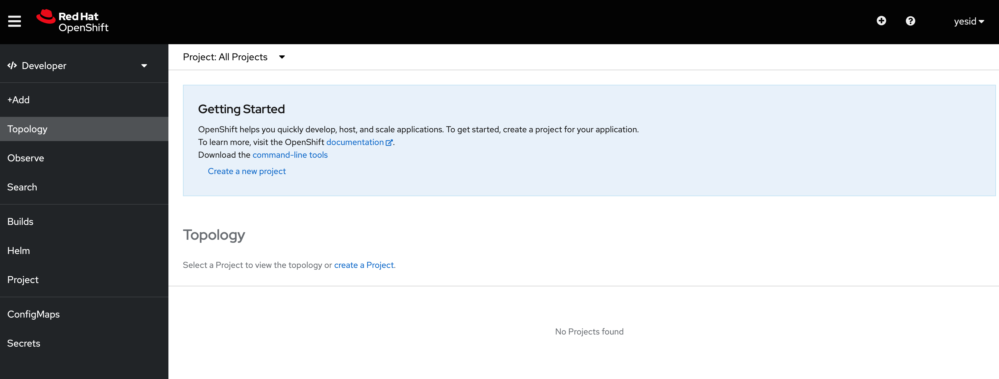
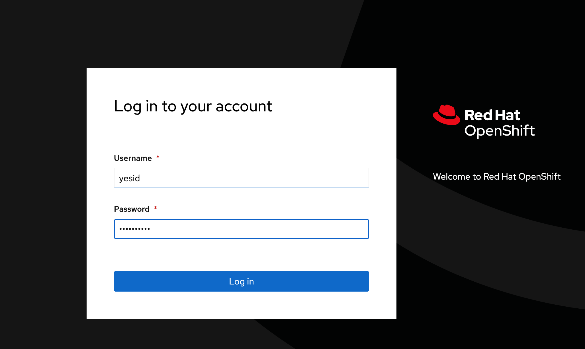

## Creacion de usuarios Locales

# Crear un nuevo usuario de HTPasswd

Ubica el archivo htpasswd que contiene los usuarios existentes. Este archivo puede haber sido utilizado previamente para configurar el proveedor de identidades htpasswd en OpenShift.

# Extraiga los datos del archivo del secreto y guardelo en la ruta /tmp


```
oc extract secret/localusers -n openshift-config > --to ~/DO280/labs/auth-provider/ --confirm

````

# Ejecuta el siguiente comando para agregar un nuevo usuario al archivo htpasswd:

```
htpasswd -b <ruta_al_archivo_htpasswd> <nombre_de_usuario> <contraseña>

````
Asegúrate de reemplazar <ruta_al_archivo_htpasswd> con la ruta correcta hacia tu archivo htpasswd, <nombre_de_usuario> con el nombre de usuario que deseas agregar y <contraseña> con la contraseña correspondiente.

# Revise el contenido de /tmp/htpasswd y verifique que incluya tres entradas con contraseñas con hash

Saida de ejemplo

```
andrew:$apr1$dZPb2ECf$ercevOFO5znrynUfUj4tb/
karla:$apr1$FQx2mX4c$eJc21GuVZWNg1ULF8I2G31
admin:$apr1$CVdDwue.$avwhkelEiHoFQhK1EYj7i0
user1:$apr1$8OrA35c1$9k4TattJblYves2Jzcrtg.
yesid:$apr1$zakizlOK$lmMcyBPXHdOly7TNWFXy.
````

# Una vez que hayas agregado el nuevo usuario al archivo htpasswd, crea o actualiza el secreto de autenticación en OpenShift.

```
oc set data secret/<secret-name> --from-file htpasswd=/tmp/htpasswd -n openshift-config
````

# Espere unos minutos para que el operador de autenticación vuelva a cargarse

openshift-authentication

# Una vez completados estos pasos, los nuevos usuarios deberían poder iniciar sesión en OpenShift utilizando sus credenciales correspondientes.





  

